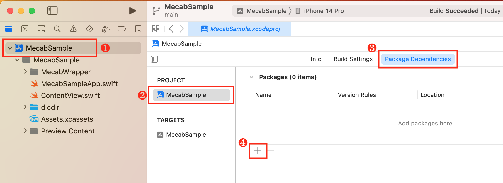
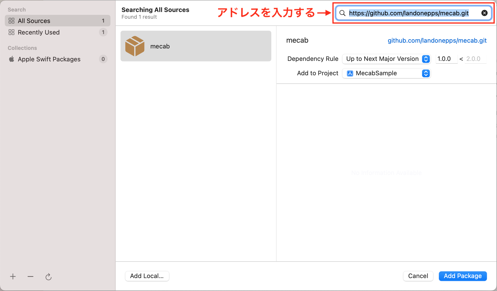
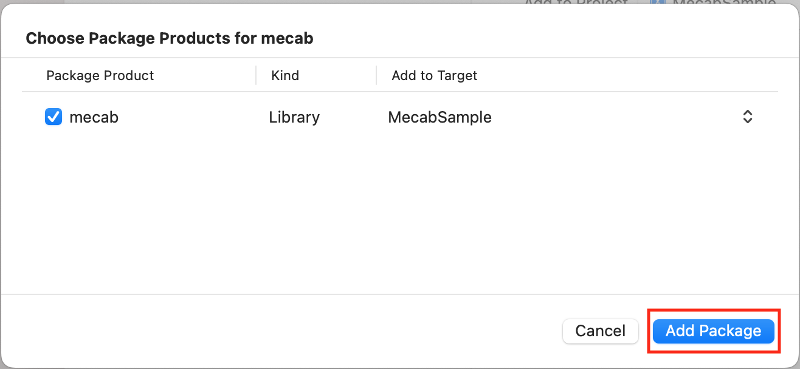
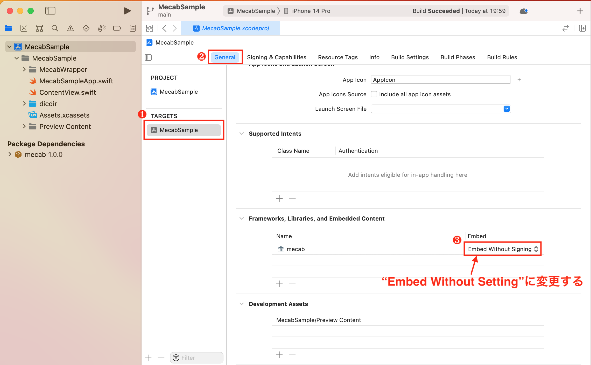
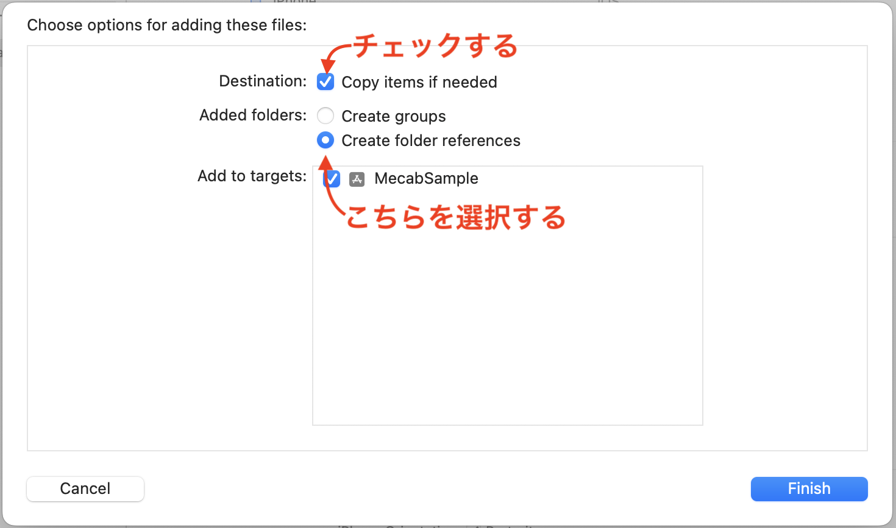

# MecabSample
MeCab(形態素解析器)のサンプルアプリ

## 導入方法

### Step1.Swift Package Managerを導入
[MeCab for Swift Package Manager](https://github.com/landonepps/mecab)を導入します。

1. SwiftPackageManagerの追加操作します


2. `https://github.com/landonepps/mecab.git`を入力します


3. Add Packageを選択します


4. mecabの内蔵方法を"Embed Without Singning"に変更する


### Step2.辞書を導入する
[MeCab Demo for iOS 15 and SPM](https://github.com/landonepps/MecabDemo)をcloneして辞書をプロジェクトに取り込みます。

- `MecabDemo/Resources/dicdir`フォルダーをプロジェクトにドラッグ＆ドロップします。
スクリーンショットのようにして取り込みます。


### Step3.Mecabを簡単に使えるラッパーを導入する
[MeCab Demo for iOS 15 and SPM](https://github.com/landonepps/MecabDemo)にある下記の３ファイルをプロジェクトに取り込みます

- [Collection+SafeSubscript.swift](https://github.com/landonepps/MecabDemo/blob/master/MecabDemo/Collection%2BSafeSubscript.swift)
- [Token.swift](https://github.com/landonepps/MecabDemo/blob/master/MecabDemo/Tokenizer/Token.swift)
- [Tokenizer.swift](https://github.com/landonepps/MecabDemo/blob/master/MecabDemo/Tokenizer/Tokenizer.swift)

### Step4.実際に形態素解析器する

```swift
let tokenizer = Tokenizer()
let parsedArray = tokenizer.parse(text)
```

